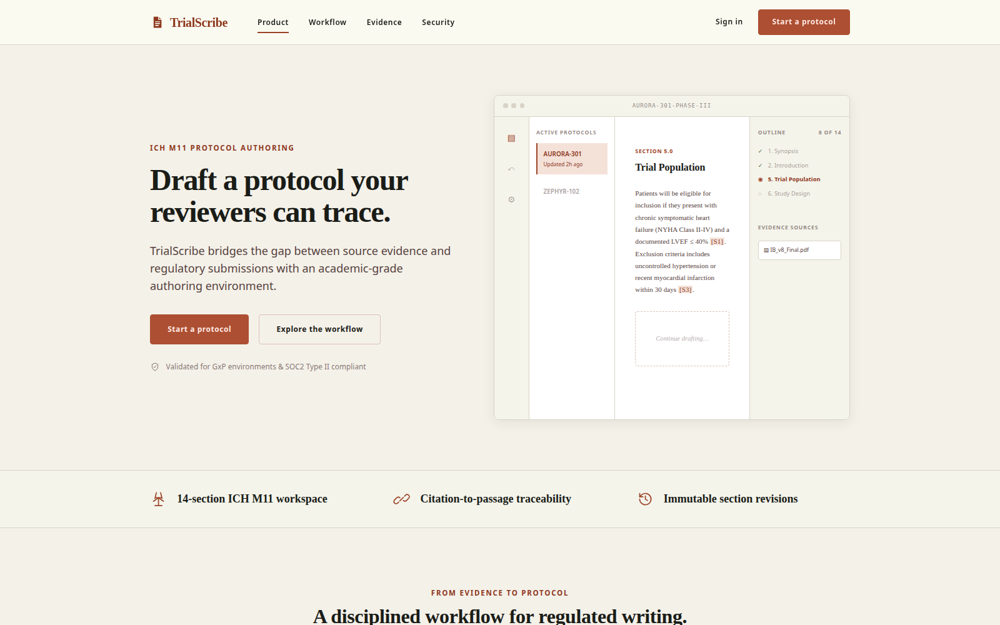
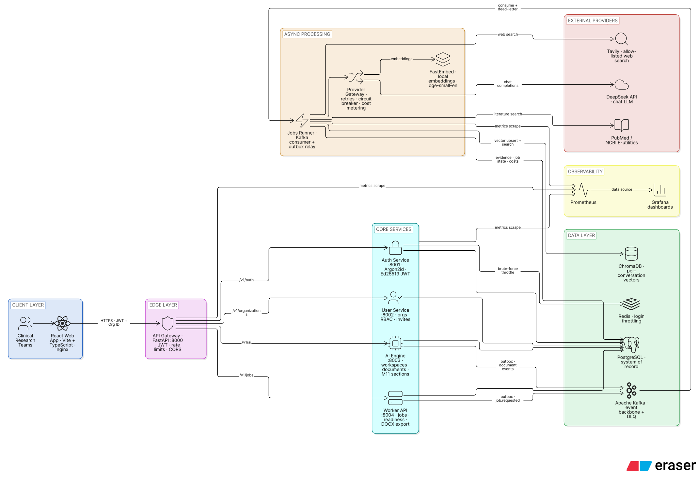
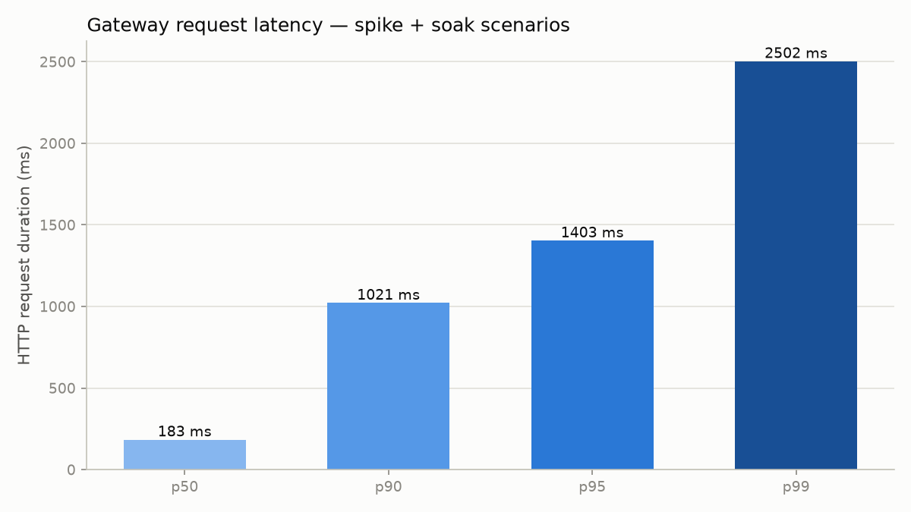
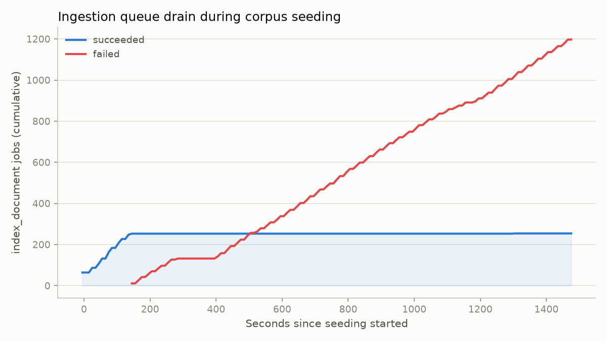

# TrialScribe

### ICH M11 Clinical Trial Protocol & Report Generation from Trial Data

  

TrialScribe is a production-grade, multi-tenant SaaS platform that helps clinical research
teams draft **ICH M11–compliant clinical trial protocol sections** directly from trial data,
uploaded source documents, and external literature. Every AI-drafted claim is grounded in a
traceable citation — an uploaded document passage, a PubMed result, or a vetted web source —
rather than an unverifiable model assertion, and finished protocols export straight to a
Word (DOCX) deliverable.

## Highlights

- **Multi-tenant, event-driven microservices architecture** — a React/TypeScript authoring
  workspace behind a FastAPI API gateway, routing to five independently deployable backend
  services (authentication, organizations, AI conversations, document/evidence retrieval, and
  asynchronous job processing) connected through an Apache Kafka event backbone.
- **Retrieval-Augmented Generation (RAG) pipeline** — document ingestion, semantic chunking,
  embedding generation, and hybrid vector/relational retrieval (ChromaDB + PostgreSQL with
  pgvector) ground every generated protocol section in traceable source passages, PubMed
  literature, and allow-listed web evidence.
- **Enterprise-grade security posture** — Ed25519-signed JWT authentication, strict per-tenant
  data isolation, per-IP rate limiting, and upload validation, verified by automated
  authorization-bypass and tenant-leakage test coverage.
- **Production-ready operations** — Prometheus/Grafana observability across every service and
  a Docker Compose release profile load-validated at 500 concurrent users and 10,000 daily
  background-job equivalents, with one-click DOCX protocol export.

## System architecture

  

Request flow: the authoring workspace calls the API gateway, which authenticates and routes
to the backend service mesh; services coordinate long-running work over the Kafka event
backbone, persist tenant-scoped state in PostgreSQL/pgvector and ChromaDB, and reach external
LLM (DeepSeek, OpenAI) and research (PubMed, allow-listed web) providers only from the worker
boundary.

## Tech stack

| Layer | Technologies |
|---|---|
| Frontend | React, TypeScript, Vite |
| Backend | Python, FastAPI, async SQLAlchemy, Alembic |
| Data & retrieval | PostgreSQL, pgvector, ChromaDB, Redis |
| Messaging | Apache Kafka (event-driven service backbone) |
| AI / RAG | Retrieval-Augmented Generation, OpenAI (embeddings), DeepSeek (chat & reasoning) |
| Infrastructure | Docker, Docker Compose, Prometheus, Grafana, k6 |

## Stress test

Feature 28 of the roadmap (`stress-and-data-scale-validation`) ran a scaled-down local
rehearsal of the platform's capacity claims — entirely against fake chat/embedding providers,
with zero real external calls. It drove a synthetic corpus of 180 accounts, 720 conversations,
and 1,520 uploaded documents through the real gateway API, then layered a k6 spike + soak load
on top while ingestion was still running.

  
  

**Gateway read path held up cleanly:** 2,151/2,151 k6 checks passed (100%), 0.00% HTTP error
rate, p95 latency 2.41s (threshold 3s). **The run also found a real capacity ceiling:**
document-indexing throughput plateaus at 254 successful jobs once the corpus reaches roughly
700 concurrently-active conversations, with failures climbing linearly afterward — flagged for
root-cause follow-up rather than smoothed over. Two real bugs were found and fixed live during
the run (an upload content-validation bug and an unhandled-timeout crash in the seed script).

Full methodology, every chart, exact reproduction commands, and the capacity-ceiling analysis:
[docs/src/stress-test-report.md](docs/src/stress-test-report.md), or the rendered version at
[docs/pages/stress-test.html](docs/pages/stress-test.html) on the documentation site.

## Documentation

The full documentation site — architecture, operations, service deep dives, and local setup,
rendered for reading rather than raw markdown — is published via GitHub Pages from
[`docs/`](docs/index.html).

- [docs/src/info.md](docs/src/info.md) — local setup, environment configuration, and every command to run,
  test, and release the platform.
- [docs/src/architecture.md](docs/src/architecture.md) — full system design and roadmap.
- [docs/src/operations.md](docs/src/operations.md) — operational runbook for the Compose release profile.
- [docs/src/api-gateway.md](docs/src/api-gateway.md), [docs/src/auth-service.md](docs/src/auth-service.md),
  [docs/src/organization-rbac.md](docs/src/organization-rbac.md),
  [docs/src/conversation-workspaces.md](docs/src/conversation-workspaces.md) — service-level deep dives.
