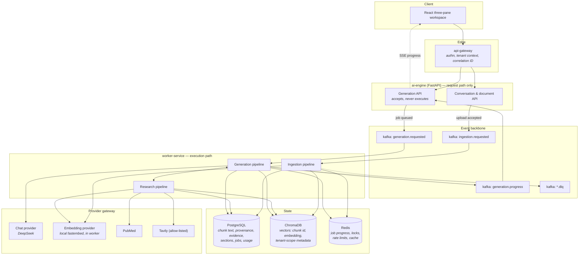
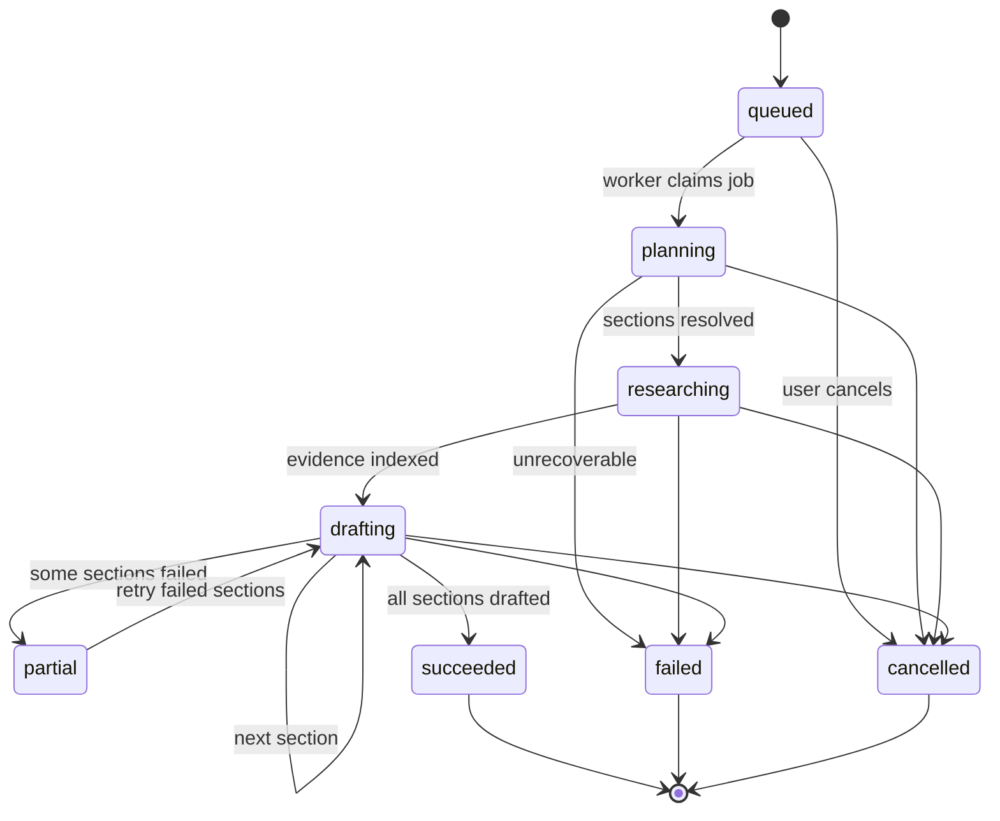

# TrialScribe — AI Engine Architecture

Status: design · Target features: ROADMAP 14–17, 20, 25 · Supersedes the AI-engine section of
[`architecture.md`](architecture.md)

The AI engine is the product. Everything else — authentication, tenancy, the gateway, the
three-pane interface — exists to get evidence into this pipeline and citation-backed M11
sections out of it. This document defines the production shape of that pipeline: what runs
where, what state it owns, how it fails, and what it costs.

---

## 1. Why the current engine is being replaced

The existing pipeline (`backend/services/ai-engine/trialscribe_ai/`) produces text, which has
made it easy to mistake for working software. It is not production-shaped. The defects below
are structural, not incidental — each one is a consequence of the design rather than a bug that
can be patched out of it.

| # | Defect | Location | Consequence |
|---|--------|----------|-------------|
| D1 | Writer node returns a compiled `StateGraph` instead of state, and calls `set_entry_point` once per section in a loop so only the last section is ever the entry point | `agents/writer.py:38-53` | At most one section is written regardless of how many the planner produced; the return value corrupts `AgentState` |
| D2 | FAISS index paths are process-global constants (`userdata_index`, `evidence_index`) | `storage/evidence_db.py:12` | Every session, conversation, and organization writes into and reads from one shared index. Cross-tenant evidence leakage by construction |
| D3 | Session state lives in a process dictionary | `api/sessions.py:26-40` | All in-flight work is lost on restart; the service cannot run more than one replica |
| D4 | Generation runs inside the HTTP request | `api/app.py:269-303` | A multi-section request blocks a worker for minutes; no progress, no cancellation, no retry |
| D5 | Synchronous provider and network calls inside `async` handlers — `llm.invoke()`, `requests.get()`, `PyPDFLoader`, FAISS embedding | `agents/*.py`, `retrieval/pubmed.py:29`, `storage/evidence_db.py:108` | The event loop stalls for the duration of every external call; concurrency is nominal only |
| D6 | Sections are researched strictly sequentially | `agents/researcher.py:44-49` | Latency scales linearly with section count when the work is embarrassingly parallel |
| D7 | No timeouts, retries, or circuit breaking on PubMed, Tavily, or the LLM; `pubmed.py` raises bare `Exception` on any non-200 | `retrieval/pubmed.py:31`, `retrieval/tavily.py` | One slow or failing upstream fails the entire generation with no partial result |
| D8 | Citations are produced by asking the model to format a reference list from prose context | `prompts/templates.py:96-140` | No stable chunk → source identity. A citation cannot be resolved back to the passage that supports it, which is the core product promise |
| D9 | No token, cost, or latency accounting anywhere | — | The per-conversation cost feature has no source of record |
| D10 | `print()` used as logging throughout | `agents/*.py`, `storage/evidence_db.py` | Nothing is queryable, correlatable, or alertable |
| D11 | `NCBI_API_KEY` raises at import time; module-level `Retriever()` and `ResearchAgent(llm)` construct clients at import | `retrieval/pubmed.py:12-16`, `agents/writer.py:8`, `agents/graph.py:11` | Import-time side effects make the service untestable without live credentials and unstartable without every key present |

Feature 14 (`ai-engine-runtime-foundation`) retires these modules rather than extending them.
`prompts/templates.py`, `retrieval/pubmed.py` XML parsing, and `retrieval/trial_processor.py`
carry forward as reference material; `agents/graph.py`, `agents/planner.py`,
`agents/researcher.py`, `agents/writer.py`, `storage/evidence_db.py`, and `api/sessions.py` are
deleted.

---

## 2. Target architecture



The load-bearing rule: **the API accepts work and reads state; the worker performs work.** No
provider call ever happens inside an HTTP request handler. This is what makes progress,
cancellation, retry, restart-safety, and horizontal scaling possible, and it is the single
largest departure from the current design.

### Service responsibilities

| Boundary | Owns | Never does |
|----------|------|------------|
| `ai-engine` (FastAPI) | Conversation, document, and section CRUD; job admission and validation; progress and result reads; SSE fan-out | Call an LLM, embed, research, or parse a document |
| `worker-service` | Ingestion, research, and generation pipelines; all provider calls; all vector writes | Serve user traffic |
| Provider gateway (library, in `worker-service`) | Timeouts, retries, circuit breaking, concurrency limits, usage metering | Contain business logic |

---

## 3. Provider strategy

DeepSeek serves generation. It publishes an OpenAI-compatible chat-completions endpoint, so the
existing OpenAI SDK is reused with a `base_url` override — no second client library.

Embeddings run **locally, in-process in the worker**, via
[fastembed](https://github.com/qdrant/fastembed) with `BAAI/bge-small-en-v1.5` — 384
dimensions, ONNX runtime, CPU-only, ~130 MB on disk. DeepSeek publishes no embeddings
endpoint, and a hosted embedding API was rejected on four grounds, recorded in ROADMAP V1
decisions:

- **Zero marginal cost.** Embedding is the highest-volume call in the system — every chunk of
  every document and every retrieved paper. At the data-scale targets in §12, a metered API is
  the wrong shape entirely.
- **No rate limits.** Ingestion throughput is bounded by local CPU, not a vendor's 429s, and
  one fewer circuit breaker has to exist.
- **Clinical text never leaves the deployment.** Uploaded protocols and trial data are
  embedded without transiting a third party — a real consideration for this product.
- **Deterministic tests and stress runs.** The same text always embeds to the same vector,
  with no credential needed in CI and no spend during load testing (§12).

The trade-off is stated honestly: `bge-small-en-v1.5` recalls less than a frontier hosted
model. The pipeline already compensates where it matters — hybrid retrieval (§4) catches the
exact identifiers embeddings miss, and relevance grading filters what retrieval over-returns.
If domain recall proves insufficient, `NeuML/pubmedbert-base-embeddings` (768 dims, biomedical
vocabulary) is the designated upgrade: a configuration change plus a reindex, which is why
`embedding_model` is stored per chunk and collections are versioned (§4). ONNX inference runs
in a bounded worker thread pool so it never blocks the event loop — D5's lesson applies to
local compute too.

Both sit behind provider protocols so neither vendor is load-bearing in application code:

```python
class ChatProvider(Protocol):
    async def complete(
        self,
        messages: list[ChatMessage],
        *,
        schema: type[BaseModel] | None = None,
        max_tokens: int,
        temperature: float,
        thinking: bool = False,   # explicit: DeepSeek defaults this ON
    ) -> ChatResult: ...   # ChatResult carries content, usage, model, latency,
                           # finish_reason, and the parameters actually applied


class EmbeddingProvider(Protocol):
    dimensions: int
    async def embed(self, texts: Sequence[str]) -> list[Sequence[float]]: ...
```

Every call returns usage alongside content. Usage is not optional and not sampled — it is the
source of record for feature 20, so a provider implementation that cannot report tokens is not
a valid implementation.

### Models and pricing

> **`deepseek-chat` and `deepseek-reasoner` are deprecated on 2026-07-24 15:59 UTC.** They are
> backward-compatibility aliases onto `deepseek-v4-flash` (non-thinking and thinking mode
> respectively). New code must name the V4 models explicitly. Note the trap in the alias
> mapping: `deepseek-reasoner` resolves to **Flash**, not Pro, so a naive substitution of
> `deepseek-v4-pro` for the old reasoner silently changes both quality and cost.

Verified against [DeepSeek pricing](https://api-docs.deepseek.com/quick_start/pricing),
2026-07-19. USD per million tokens.

| Model | Context | Max output | Cache hit in | Cache miss in | Output |
|-------|---------|-----------|--------------|---------------|--------|
| `deepseek-v4-flash` | 1M | 384K | $0.0028 | $0.14 | $0.28 |
| `deepseek-v4-pro` | 1M | 384K | $0.003625 | $0.435 | $0.87 |

| Role | Model | Why |
|------|-------|-----|
| Section drafting | `deepseek-v4-flash`, thinking disabled | Long-form generation under a large evidence context; the bulk of spend |
| Planning, query generation, relevance grading | `deepseek-v4-flash`, thinking disabled | Short, structured, high-volume calls |
| Optional deep reasoning for complex sections | `deepseek-v4-pro`, thinking enabled | Opt-in per section by configuration. Roughly 3× the output price before counting thinking tokens, which are billed as output |
| Embeddings | `BAAI/bge-small-en-v1.5` (384 dims), local fastembed | Zero marginal cost, no rate limit, no clinical-data egress (§3) |

Model IDs, context limits, and prices live in one versioned pricing table in configuration,
never inline in code. Cost is computed from that table at call time and stored with the usage
record, so historical costs stay correct when prices change.

The 1M context window is not an invitation to fill it. Retrieval quality, not context volume,
determines section quality, and cache-miss input at scale is the second-largest cost line after
output. Retrieval stays bounded by `AI_RETRIEVAL_K` and the relevance grading step.

### Provider-specific handling

These are documented DeepSeek behaviors that fail *silently* if ignored, which is why they are
architectural constraints rather than implementation notes.

- **Thinking mode defaults to enabled.** Pass `thinking: {"type": "disabled"}` explicitly on
  every drafting and utility call. Omitting it silently multiplies cost per request.
- **Thinking mode ignores sampling parameters.** `temperature`, `top_p`, `presence_penalty`,
  and `frequency_penalty` are accepted without error and have no effect when thinking is
  enabled. The provider gateway must not report a temperature it did not actually apply —
  `ChatResult` records the effective parameters, not the requested ones. (`frequency_penalty`
  and `presence_penalty` are deprecated outright and are not used.)
- **Structured output is JSON-mode only.** DeepSeek supports
  `response_format={"type": "json_object"}`; a `json_schema` strict mode is *not* documented on
  the standard endpoint. Schema conformance is therefore **our** responsibility: validate every
  response against the Pydantic model, retry once with the parse error appended, then fail the
  step. Never accept unvalidated model output into state. JSON mode also requires the literal
  word "json" in the prompt, and DeepSeek documents that it may occasionally return empty
  content — so empty-response retry is mandatory, not defensive.
- **Prompt caching is automatic and enormous.** Cache hits are ~50× cheaper than misses on
  Flash and ~120× on Pro. This is the single largest cost lever on the platform and is why
  stable-prefix prompt ordering (system → M11 section spec → trial summary → evidence →
  conversation memory → instruction) is an architectural constraint. Sections drafted within
  one conversation share the first three blocks, so most of the prompt is a cache hit after
  the first section; the volatile blocks — the rolling summary and recent turns (§5.4) — sit
  last so their churn cannot invalidate the cached prefix.
  **Do not model spend against an assumed hit rate** — DeepSeek documents caching as
  best-effort with no guarantee and no stated minimum cacheable prefix. Budget against
  cache-miss pricing and treat hits as upside.
- **Tool calls with thinking enabled** require `reasoning_content` to be echoed back on every
  subsequent turn or the API returns 400.

### Rate limits

DeepSeek limits by **concurrency, not requests or tokens per minute**: 2,500 concurrent for
Flash, 500 for Pro. Overflow returns HTTP 429 as an outright rejection — there is no queuing —
and connections close if inference has not started within 10 minutes.

This maps directly onto the design: the per-provider semaphore (§7) is sized against the
concurrency ceiling so backpressure is applied inside the worker rather than absorbed as 429s,
and client-side retry with jittered backoff is mandatory rather than optional.

DeepSeek publishes **no SLA or uptime guarantee**. For a clinical product this argues for
keeping the chat provider genuinely swappable — which the `ChatProvider` protocol already does
— and for treating provider unavailability as an expected operating condition rather than an
exceptional one.

---

## 4. Vector storage

Vectors live in **ChromaDB**, a dedicated Compose service. **PostgreSQL remains the source of
record** for everything else about a chunk — content, token counts, provenance, tenancy. FAISS
and on-disk index files are removed along with their dependencies, and the pgvector extension
is no longer used for vectors — feature 14 retires it from the schema.

| Store | Holds | Never holds |
|-------|-------|-------------|
| PostgreSQL (`document_chunks`, `evidence_chunks`) | Chunk text, token counts, provenance (page, char span, source URL), tenant keys, `embedding_model`, `indexed_at` | Vectors |
| Chroma (`document_chunks_v1`, `evidence_chunks_v1` collections) | Chunk UUID ↔ embedding, plus `organization_id` / `conversation_id` / `document_id` as filter metadata | Chunk text, or anything user-readable |

The split is deliberate: Chroma answers exactly one question — *which chunk IDs are nearest to
this query vector within this scope* — and PostgreSQL answers everything else. The
tenant-safety consequence of that division is worked out below.

### Schema

Two tables, both under the existing `trialscribe` schema, both carrying explicit tenant keys.

```sql
-- Passages extracted from user-uploaded documents and trial JSON.
CREATE TABLE trialscribe.document_chunks (
    id                UUID PRIMARY KEY,
    organization_id   UUID NOT NULL,
    conversation_id   UUID NOT NULL,
    document_id       UUID NOT NULL,
    chunk_index       INTEGER NOT NULL,
    content           TEXT NOT NULL,
    token_count       INTEGER NOT NULL,
    page_number       INTEGER,          -- provenance: where in the source
    char_start        INTEGER,          -- provenance: exact span for citation resolution
    char_end          INTEGER,
    embedding_model   TEXT NOT NULL,    -- reindex trigger when this changes
    indexed_at        TIMESTAMPTZ,      -- set when the vector upsert to Chroma succeeds
    created_at        TIMESTAMPTZ NOT NULL DEFAULT now(),
    FOREIGN KEY (conversation_id, organization_id)
        REFERENCES trialscribe.conversations (id, organization_id) ON DELETE CASCADE,
    UNIQUE (document_id, chunk_index)
);

-- Passages retrieved from PubMed and allow-listed web research.
CREATE TABLE trialscribe.evidence_chunks (
    id                UUID PRIMARY KEY,
    organization_id   UUID NOT NULL,
    conversation_id   UUID NOT NULL,
    source_kind       TEXT NOT NULL,    -- 'pubmed' | 'web'
    source_url        TEXT NOT NULL,
    source_title      TEXT NOT NULL,
    source_authors    TEXT,
    published_at      DATE,
    retrieved_at      TIMESTAMPTZ NOT NULL,
    content_hash      TEXT NOT NULL,    -- deduplication key
    chunk_index       INTEGER NOT NULL,
    content           TEXT NOT NULL,
    token_count       INTEGER NOT NULL,
    embedding_model   TEXT NOT NULL,
    indexed_at        TIMESTAMPTZ,
    created_at        TIMESTAMPTZ NOT NULL DEFAULT now(),
    FOREIGN KEY (conversation_id, organization_id)
        REFERENCES trialscribe.conversations (id, organization_id) ON DELETE CASCADE,
    UNIQUE (conversation_id, content_hash, chunk_index)
);
```

The composite foreign key to `(conversations.id, conversations.organization_id)` follows the
pattern already established by `conversation_messages` — it makes a chunk whose
`organization_id` disagrees with its conversation's *unrepresentable*, rather than merely
unlikely. Tenant isolation is a schema property here, not a query convention. Chroma can
express no such constraint, which is exactly why chunk content is never served from Chroma
(below).

The scope index remains, serving lexical search and hydration:

```sql
CREATE INDEX ix_document_chunks_scope
    ON trialscribe.document_chunks (organization_id, conversation_id);
```

### Collections

Chroma holds exactly two collections — `document_chunks_v1` and `evidence_chunks_v1` — cosine
space, created by migration code with pinned HNSW parameters (`hnsw:search_ef` from
configuration, starting at 4 × k). Two decisions here are load-bearing:

- **Never one collection per conversation or organization.** Each Chroma collection is its own
  index with its own fixed overhead. At millions of conversations (§12) that would mean
  millions of tiny indexes — an unbounded resource leak. Scope lives in filter metadata
  (`organization_id`, `conversation_id`), and every query passes a `where` clause on both.
- **The `_v1` suffix is the reindex mechanism.** An embedding-model change builds `_v2`
  alongside `_v1` from the PostgreSQL rows (which record `embedding_model` per chunk), cuts
  over by configuration, then drops `_v1`. No in-place mutation of a live index.

### Tenant safety: Chroma is an untrusted index

The composite foreign keys above make a mis-scoped *row* unrepresentable in PostgreSQL. Chroma
has no such construct — its `where` filter is a query convention, exactly the property this
architecture refuses to rely on. The resolution is structural:

**Chroma never stores or returns chunk content.** A vector query returns IDs and distances
only. Content is hydrated by a PostgreSQL read that re-applies tenant scope:

```sql
SELECT id, content, page_number, char_start, char_end
FROM trialscribe.document_chunks
WHERE id = ANY($1) AND organization_id = $2 AND conversation_id = $3;
```

A vector that escaped its scope filter — a bug, index drift, a future migration mistake — can
waste a result slot; it cannot leak another tenant's text, because hydration drops it. Every
dropped ID increments `ai_retrieval_scope_mismatch_total` and is logged: it is evidence of a
filter bug or index drift, never noise. Retrieval-scope tests assert both layers
independently.

All Chroma access goes through one wrapper module whose query API *requires* organization and
conversation IDs — application code cannot express an unscoped vector query.

### Write path and reconciliation

PostgreSQL commits first; the Chroma upsert follows, keyed by chunk UUID so Kafka redelivery
overwrites rather than duplicates; `indexed_at` is stamped only after the upsert succeeds. A
document becomes retrievable only when all of its chunks are indexed.

Deleting a conversation cascades its chunk rows in PostgreSQL and issues a Chroma delete by
`conversation_id` filter. Because the two stores cannot share a transaction, drift is expected
and owned by a periodic reconciliation job (a Redis-lock singleton): rows with
`indexed_at IS NULL` beyond a threshold are re-embedded and re-upserted; Chroma IDs with no
surviving row are deleted. Losing Chroma entirely is a rebuild, not a data loss — every vector
is reconstructible from PostgreSQL content plus the recorded `embedding_model`.

> **Filtered-search caveat — carried over from the earlier pgvector design, because it is a
> property of filtered HNSW, not of a vendor.** A `where`-filtered ANN query can return fewer
> than `k` results when the conversation's chunks are sparse in the collection, and a section
> drafted from four passages instead of twenty looks like a quality problem, not an indexing
> problem — which is what makes this failure mode expensive to diagnose. Set `hnsw:search_ef`
> generously (start at 4 × k), monitor `ai_retrieval_shortfall_total` (queries returning fewer
> than `k` for conversations known to hold at least `k` chunks), and raise `search_ef` before
> suspecting the embedding model.

### Memory budget

At 384 dimensions a vector costs ~1.5 KB plus roughly 0.2 KB of HNSW graph per element —
budget **~2 GB of Chroma residency per million chunks**. The 10M-chunk data-scale target (§12)
therefore fits in roughly 20 GB on the reference host, and this — not PostgreSQL — is the
binding constraint on corpus size. Past it, the wrapper's scoped routing extends to sharding
collections across Chroma nodes by organization bucket; that is deliberately out of v1.

### Retrieval

Retrieval is hybrid and tenant-scoped, in this order:

1. **Vector search** against both Chroma collections, `where`-filtered to the requesting
   conversation and organization, hydrated through the tenant-scoped PostgreSQL read above.
2. **Lexical search** over the same chunk rows using PostgreSQL full-text search. Clinical
   text is dense with identifiers — protocol numbers, dose strings, endpoint names — that
   embeddings handle poorly and exact matching handles well. This is half of why chunk text
   lives in PostgreSQL rather than in Chroma documents.
3. **Fusion** of both result sets by reciprocal rank, not by raw score. Chroma cosine distance
   and `ts_rank` are not comparable quantities — they now come from two different engines —
   and the current code's `combined.sort(key=score)` across two different stores
   (`retrieval/retriever.py:50`) is exactly this mistake.
4. **Relevance grading** of the fused top-N by a cheap `deepseek-v4-flash` call, dropping passages
   that do not support the section. This is the highest-leverage quality step in the pipeline
   and the cheapest place to spend tokens.
5. **User-evidence precedence.** Uploaded documents and trial JSON outrank web evidence at
   equal relevance. The protocol is about *this* trial; the literature is supporting context.

---

## 5. The pipelines

### 5.1 Ingestion

Triggered by `ingestion.requested` after an upload is accepted and persisted.

```
validate → extract → normalize → chunk → embed (batched) → persist → mark ready
```

- **Validate** at the API boundary before the job is ever queued: declared type against sniffed
  content, size ceiling, page ceiling.
- **Extract** in a bounded subprocess. Document parsers are the most common source of hangs and
  memory blowups on adversarial input, and they must not be able to take a worker down.
- **Chunk** on structure first (headings, sections) and fall back to recursive character
  splitting, targeting ~800 tokens with ~15% overlap. Retain `page_number` and character span
  on every chunk — this is what makes a citation resolvable, and its absence is defect D8.
- **Embed** locally in batches on the worker's bounded ONNX thread pool, checkpointing
  progress per batch so a restarted job resumes rather than re-embedding from zero. Embedding
  is the dominant *compute* of ingestion rather than its dominant cost — throughput is sized
  by `AI_EMBEDDING_THREADS`, not by a vendor rate limit.
- **Persist** chunk rows to PostgreSQL first, then upsert vectors to Chroma and stamp
  `indexed_at` (§4). Only fully indexed documents become retrievable.
- **Idempotency** on `(document_id, chunk_index)`, so redelivery of the Kafka message cannot
  double-insert; the Chroma upsert is keyed by chunk UUID, so replays overwrite rather than
  duplicate.

Documents are `pending → processing → ready → failed`. Only `ready` documents are retrievable,
and the interface shows the difference — a silently unindexed upload that produces an
evidence-free section is a far worse failure than a visible one.

### 5.2 Research

Runs per section, fanned out with bounded concurrency — replacing D6's sequential loop.

```
section → generate queries → PubMed ∥ Tavily → dedupe → chunk → embed → persist
```

- Queries are generated once per section by a structured `deepseek-v4-flash` call and cached in
  Redis keyed by section and trial hash.
- PubMed and Tavily run concurrently, each behind its own timeout, retry budget, and circuit
  breaker. Tavily stays restricted to the existing `allowed_websites.yml` allow-list.
- Deduplication is by `content_hash` before embedding — the same paper surfacing from both
  providers must not be embedded, stored, or indexed twice.
- **Research failure is partial, never fatal.** If PubMed is down, the section is written from
  uploaded evidence and web results, and the degradation is recorded on the job and surfaced in
  the interface. The current design fails the entire generation (D7).

### 5.3 Generation

The core loop. One job, N requested sections, each an independently retryable unit.



1. **Plan.** Resolve the user's instruction against the M11 section catalog (feature 10) into a
   concrete list of sections. The catalog is a fixed, versioned data structure — the model
   *selects from* it and does not invent section titles, which is what the current free-form
   planner prompt permits.
2. **Research** each unresearched section (5.2), bounded concurrency.
3. **Draft** each section: retrieve (§4), assemble the cache-friendly prompt (§3, §5.4), call
   `deepseek-v4-flash`, validate that every citation marker resolves to a retrieved chunk ID,
   persist the draft with its citation set and usage record, emit progress.
4. **Verify citations.** The model emits markers referencing chunk IDs it was given. Any marker
   that does not resolve is stripped and the claim flagged, and the count is recorded on the
   job. A citation that cannot be resolved to a stored passage never reaches the user.
5. **Assemble** on request into the export (feature 21) — not eagerly.

Per-section independence is the point: section 3 failing on a provider timeout must not discard
sections 1, 2, and 4, and retrying it must not redraft them. Each section write is its own
transaction, keyed for idempotency on `(job_id, section_id, attempt)`.

### 5.4 Conversation memory

The model's memory is not the chat scroll. A plain last-N window fails in both directions —
small enough to be cheap, it silently forgets the instruction from turn 4; large enough to be
safe, it drags thousands of stale tokens into every call. The 1M context window is not the fix
either (§3): an ever-growing prompt is paid for on every cache miss, and recall degrades for
facts buried mid-context.

The design instead treats almost everything that matters as **structured state injected per
task**: the trial summary comes from the uploaded JSON, the section spec from the M11 catalog,
evidence from retrieval, and the current draft with its revision history from the section row.
None of it depends on replaying messages. What remains for chat context is the conversational
residue — "as I said earlier, avoid naming the Phase II results" — and that is served by three
bounded layers:

| Layer | Content | Bound |
|-------|---------|-------|
| Recent turns | The last `AI_CONTEXT_RECENT_TURNS` messages, verbatim | Fixed count |
| Rolling summary | A digest of everything older, stored on the conversation row with a message-ID watermark, refreshed by a background `deepseek-v4-flash` call as turns age out of the verbatim window | `AI_CONTEXT_SUMMARY_MAX_TOKENS` |
| Promoted instructions | Standing rules stored as per-section and per-conversation instruction fields (features 10 and 19), injected on every call regardless of age | Schema fields, not prose |

Promotion is the load-bearing layer. An instruction that must survive the whole conversation —
"always use generic drug names" — is a database field, not a hope that the summarizer keeps
it; the interface offers to save exactly such rules rather than leaving them buried in chat.
The summary is durable state, not cache: it lives in PostgreSQL, and losing it means
re-summarizing from stored messages, never losing memory. Summarization calls are metered like
every other provider call (`purpose = 'summarize'`), and the token cost of memory is flat with
conversation length rather than growing with it.

Retrieval over old messages — the same RAG machinery of §4 pointed at
`conversation_messages` — is the designated fourth layer if very long conversations outgrow
the summary. It is deliberately out of v1.

**Ordering constraint.** The memory blocks are the most volatile part of the prompt, so they
sit *after* the stable blocks: system → section spec → trial summary → evidence → memory →
instruction (§3). Placing the rolling summary early would invalidate DeepSeek's cached prefix
on every refresh and silently multiply input cost.

---

## 6. Job lifecycle and coordination

**Kafka carries work; Redis carries progress; PostgreSQL carries truth.**

| Concern | Store | Rationale |
|---------|-------|-----------|
| Job queue and lifecycle events | Kafka | Durable, replayable, partitioned by `organization_id` so one tenant's backlog cannot starve another |
| Live progress, per-section state, heartbeats | Redis | High-frequency writes that must not touch the transactional database |
| Job record, section content, citations, usage | PostgreSQL | The only source of record; Redis is a cache and may be lost |

Redis progress is reconstructible from PostgreSQL. Losing Redis degrades progress reporting
until the next checkpoint; it never loses work.

### Topics

| Topic | Key | Payload |
|-------|-----|---------|
| `trialscribe.ingestion.requested.v1` | `document_id` | Document identity, tenant, conversation |
| `trialscribe.generation.requested.v1` | `job_id` | Job identity, tenant, conversation, sections, instruction |
| `trialscribe.generation.progress.v1` | `job_id` | Phase, per-section state, counters |
| `trialscribe.generation.completed.v1` | `job_id` | Terminal outcome, usage totals |
| `trialscribe.*.dlq.v1` | original key | Original message, failure reason, attempt count |

Every event carries `event_id`, `event_version`, `organization_id`, `correlation_id`, and
`causation_id` — the same correlation ID the gateway already propagates, so one user action is
traceable from browser to provider call.

### Delivery guarantees

Kafka gives at-least-once delivery, so **every consumer must be idempotent**. Consumers claim
work with a Redis lock keyed by `job_id`, held with a TTL and renewed by heartbeat. A worker
that dies has its lock expire and its job reclaimed; a worker that hangs stops heartbeating and
is preempted. Retries are bounded with jittered exponential backoff, and exhausted messages go
to the DLQ with their failure reason rather than being dropped or retried forever.

Cancellation is cooperative: the API writes a cancellation flag to Redis, and the worker checks
it at each section boundary. Work already completed is kept — a cancelled three-of-five job
leaves three drafted sections, not zero.

---

## 7. Resilience

Every external call is wrapped by the provider gateway with, in order:

1. **Timeout** — connect and read, per provider, always set. No unbounded call exists anywhere
   in the system.
2. **Retry** — bounded attempts with jittered exponential backoff, only on retryable classes
   (429, 5xx, connection, timeout). Never on 4xx client errors, which retrying cannot fix.
3. **Circuit breaker** — per provider. After a failure threshold, fail fast for a cooldown
   rather than queueing work behind a dead upstream, then probe with a half-open request.
4. **Concurrency limit** — a semaphore per provider, sized to its rate limit, applying
   backpressure inside the worker instead of generating 429s.
5. **Budget ceiling** — a per-job token and wall-clock cap. A runaway job is killed and marked
   failed rather than being allowed to consume the organization's spend.

The local embedding provider is not an external call — it needs no breaker, only its bounded
thread pool — but Chroma *is* a network dependency, and its client gets the same timeout and
retry treatment as any provider.

Degradation is explicit and ranked. Research providers are optional; Chroma is required for
ingestion and retrieval but not for serving already-drafted sections; the chat provider is
required for drafting. The system states which capability is degraded rather than failing
opaquely.

---

## 8. Usage and cost metering

One `provider_calls` row per external model call, written by the provider gateway itself so no
call site can forget:

```sql
CREATE TABLE trialscribe.provider_calls (
    id                 UUID PRIMARY KEY,
    organization_id    UUID NOT NULL,
    conversation_id    UUID,
    job_id             UUID,
    section_id         UUID,
    account_id         UUID,
    provider           TEXT NOT NULL,        -- 'deepseek' | 'local'
    model              TEXT NOT NULL,
    purpose            TEXT NOT NULL,        -- 'plan' | 'query' | 'grade' | 'draft' | 'embed' | 'summarize'
    prompt_tokens      INTEGER NOT NULL,
    cached_tokens      INTEGER NOT NULL DEFAULT 0,
    completion_tokens  INTEGER NOT NULL,
    reasoning_tokens   INTEGER NOT NULL DEFAULT 0,
    cost_micros        BIGINT NOT NULL,      -- integer micros; never floating point
    pricing_version    TEXT NOT NULL,
    latency_ms         INTEGER NOT NULL,
    outcome            TEXT NOT NULL,        -- 'ok' | 'error' | 'timeout' | 'circuit_open'
    created_at         TIMESTAMPTZ NOT NULL DEFAULT now()
);
```

Cost is stored as integer micros against a versioned pricing table — floating-point currency
accumulated over millions of calls drifts, and a price change must not retroactively rewrite
history. Conversation totals are a rollup of these rows.

Local embedding calls are still metered — `provider = 'local'`, `cost_micros = 0` — because
volume and latency remain operational signals even when spend is zero, and because a future
switch to a hosted embedding provider must not create a blind spot in the record.

LangSmith, if enabled, is a tracing convenience only. It is never the source of record for
cost, per the roadmap's V1 decision.

---

## 9. Observability

Every service already exposes health endpoints; feature 22 adds metrics. The AI-specific
families that matter:

| Metric | Type | Labels | Answers |
|--------|------|--------|---------|
| `ai_job_duration_seconds` | histogram | `phase`, `outcome` | Where does time actually go? |
| `ai_sections_total` | counter | `outcome` | What fraction of sections fail? |
| `ai_provider_requests_total` | counter | `provider`, `model`, `purpose`, `outcome` | Which upstream is unhealthy? |
| `ai_provider_latency_seconds` | histogram | `provider`, `model` | Is DeepSeek slow right now? |
| `ai_tokens_total` | counter | `provider`, `model`, `kind` | Where is spend going? |
| `ai_circuit_state` | gauge | `provider` | Is a breaker open? |
| `ai_queue_depth` | gauge | `topic` | Are workers keeping up? |
| `ai_citation_unresolved_total` | counter | — | Is grounding degrading? |
| `ai_retrieval_shortfall_total` | counter | `collection` | Are filtered vector queries starving sparse conversations? |
| `ai_retrieval_scope_mismatch_total` | counter | `collection` | Is the vector index leaking scope (caught at hydration)? |

Labels are bounded and never carry `organization_id`, `conversation_id`, or any user content —
unbounded label cardinality is the standard way to destroy a Prometheus instance.

Structured JSON logs replace `print()`, carrying `correlation_id`, `job_id`, `organization_id`,
phase, and outcome. Prompts, evidence text, trial data, and API keys are never logged.

---

## 10. Security and tenancy

- Every vector query filters on `organization_id` **and** `conversation_id`, and chunk content
  is only ever served by a tenant-scoped PostgreSQL read (§4) — a mis-scoped vector cannot
  leak text, only waste a result slot. Retrieval-scope tests assert that a foreign
  conversation's chunks are unreachable at both layers, and the composite foreign key makes a
  mis-scoped row unrepresentable in the first place.
- Uploaded content is parsed in a bounded subprocess and is never interpolated into a prompt
  without traversing the chunk store, which keeps a document's text from being treated as
  instruction.
- Retrieved evidence is untrusted input. Prompts state explicitly that evidence is data, not
  instruction — a fetched web page attempting prompt injection is a realistic threat for a
  system that reads the open internet.
- Web research stays on the configured allow-list.
- Provider credentials come from environment configuration, are redacted in representations and
  errors, and never appear in logs or API responses.
- API errors return fixed, allow-listed messages, per the existing CRAFT security baseline.

---

## 11. Configuration

New keys, all recorded in `.env_example` with placeholders:

| Key | Purpose |
|-----|---------|
| `AI_CHAT_PROVIDER` / `AI_CHAT_BASE_URL` / `AI_CHAT_API_KEY` | Chat provider selection and credential |
| `AI_CHAT_MODEL` / `AI_REASONING_MODEL` | Model identity per role (`deepseek-v4-flash` / `deepseek-v4-pro`) |
| `AI_REASONING_ENABLED_SECTIONS` | Section IDs that opt into the thinking-mode model; empty by default |
| `AI_EMBEDDING_PROVIDER` | Embedding provider selection; `fastembed` by default, hosted providers stay configurable through the same protocol |
| `AI_EMBEDDING_MODEL` / `AI_EMBEDDING_DIMENSIONS` | `BAAI/bge-small-en-v1.5` / `384`; a change to either forces a versioned reindex (§4) |
| `AI_EMBEDDING_BATCH_SIZE` / `AI_EMBEDDING_THREADS` | Local inference batching and thread-pool bound |
| `CHROMA_URL` / `CHROMA_PORT` | Vector store endpoint (Compose service) |
| `AI_PROVIDER_TIMEOUT_SECONDS` / `AI_PROVIDER_MAX_ATTEMPTS` | Resilience policy |
| `AI_PROVIDER_MAX_CONCURRENCY` | Per-provider semaphore size |
| `AI_CIRCUIT_FAILURE_THRESHOLD` / `AI_CIRCUIT_COOLDOWN_SECONDS` | Breaker policy |
| `AI_JOB_TOKEN_BUDGET` / `AI_JOB_TIMEOUT_SECONDS` | Per-job ceilings |
| `AI_RETRIEVAL_K` / `AI_RETRIEVAL_EF_SEARCH` | Retrieval tuning; `EF_SEARCH` is applied as the collections' `hnsw:search_ef` |
| `AI_CHUNK_TOKENS` / `AI_CHUNK_OVERLAP_RATIO` | Chunking policy |
| `AI_CONTEXT_RECENT_TURNS` / `AI_CONTEXT_SUMMARY_MAX_TOKENS` | Conversation-memory bounds (§5.4) |
| `AI_PRICING_VERSION` | Pricing table selection for cost computation |

`OPENAI_API_KEY` is needed only by the legacy pipeline and is removed when feature 14 retires
it — no external credential is required for embeddings. `MAX_RESULTS`, `K_value`, and
`NUM_WORDS` are replaced by the namespaced keys above.

---

## 12. Capacity and scale targets

Two kinds of target, validated separately because they stress different things:

| Dimension | Target | Binding constraint | Validated by |
|-----------|--------|--------------------|--------------|
| Registered users | 100,000+ | Nothing interesting — PostgreSQL rows | Feature 25 seeded corpus |
| Conversations / messages | 5M+ / 50M+ | PostgreSQL indexes, keyset pagination | Feature 25 seeded corpus |
| Documents / vector chunks | 1M+ / 10M+ | Chroma residency, ~2 GB per 1M chunks (§4) | Feature 25 seeded corpus + retrieval-latency runs |
| Concurrent users | 500 | Gateway workers, provider semaphores | Feature 24 load test |
| Generation jobs | 10,000/day | Worker replicas × provider concurrency | Feature 24 load test |

Data scale and throughput are deliberately decoupled. Millions of documents and conversations
are a storage-and-retrieval property — index sizes, filtered-ANN recall, pagination under deep
offsets — while concurrent load is a queueing property — Kafka partitions, worker replicas,
provider semaphores. A system can hold 10M chunks and still choke at 50 concurrent users, or
the reverse. This is why features 24 and 25 are separate validation campaigns, and why **no
scale number is claimed anywhere until the corresponding campaign's report exists**. The
numbers in this table are design targets; the stress reports turn them into claims.

Throughput behavior against those targets:

- 10,000 jobs/day averages ~7/minute, but arrives in bursts. Kafka absorbs the burst; worker
  replicas set the drain rate. Partition count sets the concurrency ceiling, so partitions must
  exceed the intended worker count.
- Drafting dominates wall-clock. Per-section concurrency within a job cuts latency; per-job
  concurrency across workers sets throughput. Both are bounded by provider rate limits, which
  is why the semaphore lives at the provider boundary rather than the job boundary.
- Prompt caching is the primary cost lever, which is why prompt block order (§3) is an
  architectural constraint and not a formatting preference.
- Embedding throughput is local CPU (§3). Seeding the 10M-chunk corpus is an hours-long batch
  job, not a bill; re-embedding wastes compute rather than spend, and deduplication by
  `content_hash` plus per-batch checkpointing still prevent doing the same work twice.

### Stress and load testing without real side effects

No load, stress, soak, or chaos run ever makes a real external call — a standing policy,
recorded in the roadmap alongside the full methodology. What makes it cheap is already in this
architecture: every external effect passes through a provider protocol (§3), so substitution
is configuration, not surgery.

| Real dependency | Under stress test |
|-----------------|-------------------|
| DeepSeek chat | Deterministic fake `ChatProvider`: template completions sized to the requested `max_tokens`, configurable latency distribution, injectable 429/5xx/timeout/empty-response faults, plausible usage numbers |
| Embeddings | The real thing — local, free, deterministic (§3); one of the reasons it was chosen |
| PubMed / Tavily | Record–replay fixtures captured once from real responses, served with injectable faults |
| Chroma / PostgreSQL / Redis / Kafka | Real instances — the point is to stress *our* infrastructure, never someone else's |

The fake chat provider is not a test convenience — it is how circuit breakers, retry budgets,
partial-failure paths, and budget ceilings (§7) get exercised at all. It ships inside feature
14 with the gateway itself, not retrofitted at validation time.

---

## 13. Build sequence

This architecture is delivered by roadmap features 14–17, in order:

| Feature | Delivers |
|---------|----------|
| 14 · `ai-engine-runtime-foundation` | Provider gateway with deterministic fakes, resilience policy, usage metering, local embedding runtime, Chroma collections + PostgreSQL chunk schema, legacy removal |
| 15 · `rag-indexing-retrieval` | Ingestion pipeline, hybrid retrieval, provenance |
| 16 · `web-research-evidence` | PubMed and web research, deduplication, partial-failure handling |
| 17 · `citation-backed-section-generation` | Planning, drafting, citation verification, per-section retry |

Features 12 (`kafka-event-backbone`) and 13 (`background-job-runtime`) are prerequisites and
precede all of the above. Feature 24 then validates the release profile at the throughput
target, and feature 25 runs the data-scale stress campaign (§12) against the provider
substitutes — the reports those two produce are what turn this document's targets into
verifiable claims.
