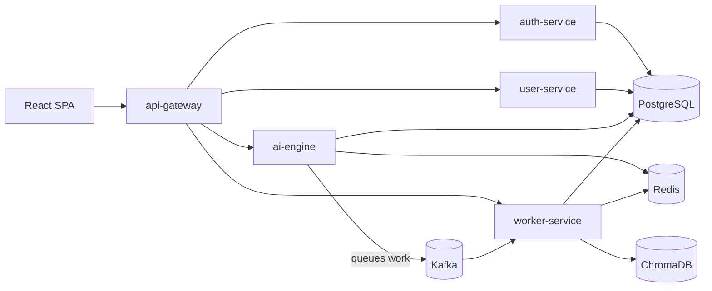

# TrialScribe — Architecture

Platform-level overview. The AI pipeline — by far the largest subsystem — has its own document:
[`ai-engine-architecture.md`](ai-engine-architecture.md).

## Shipped services

| Service | Package | Responsibility |
|---------|---------|----------------|
| `api-gateway` | `trialscribe_gateway` | Single entry point; authenticates requests, propagates trusted identity, organization context, and one correlation ID per user action |
| `auth-service` | `trialscribe_auth` | Local accounts, Ed25519 access tokens, rotated and revocable refresh tokens |
| `user-service` | `trialscribe_user` | Organizations, memberships, RBAC, invitations |
| `ai-engine` | `trialscribe_ai` | Conversation workspaces today; document, section, and generation APIs as the roadmap lands |
| `worker-service` | `trialscribe_worker` | Health boundary today; the execution path for all AI work from roadmap feature 13 onward |
| `database` (package) | `trialscribe_db` | Shared PostgreSQL configuration, model conventions, Alembic migrations, async transaction runtime |

Local infrastructure — PostgreSQL 18, Redis, Kafka in KRaft mode, and ChromaDB — runs from
the `infrastructure` Compose profile.

Roadmap features 1–7 are shipped: platform skeleton, local runtime infrastructure, the Postgres
data foundation, authentication, organization RBAC, the gateway, and conversation workspaces.
See `.sdlc/ROADMAP.md` for the full sequence and `.sdlc/STATE.md` for shipped dates.

## Request and execution paths

The separation that matters: **the API path accepts and reads; the worker path executes.** No
long-running or provider-dependent work happens inside an HTTP request. This is what makes
progress reporting, cancellation, retry, restart-safety, and horizontal scaling possible.

## Data

One PostgreSQL instance, one `trialscribe` schema, one Alembic migration history owned by
`backend/packages/database`. Every tenant-scoped table carries `organization_id`, and child
tables reference parents by composite key including the tenant column, so a mis-scoped row is
unrepresentable rather than merely unlikely.

ChromaDB is the only vector index, holding chunk IDs, embeddings, and tenant-scope metadata —
never chunk text. PostgreSQL remains the source of record for chunk content and provenance, so
vectors are always rebuildable from it. Redis holds ephemeral coordination — job progress,
locks, rate limits, caches — and is always reconstructible from PostgreSQL. The full design,
including why chunk content is never served from Chroma, is in
[`ai-engine-architecture.md`](ai-engine-architecture.md).

## Frontend

`frontend/web` is the production React + TypeScript SPA, and roadmap feature 8 builds it out
into an authenticated shell. It moved ahead of the AI pipeline in the sequence specifically so
the platform becomes testable by hand early; the reasoning is recorded in the roadmap.

`frontend/streamlit-ui` is an interim demo interface that drives the legacy AI pipeline
directly. It is explicitly out of v1 as a supported frontend and is retired once feature 11
lands.

## Repository tooling

`backend/` is a uv workspace: `backend/pyproject.toml` is the root, with each service and the
shared database package as members. Use `uv sync --all-packages` — plain `uv sync` resolves only
the root and leaves member packages unavailable.

`frontend/web` is an npm project. `frontend/streamlit-ui` is deliberately outside the backend
workspace — a standalone uv project with its own lockfile depending on `trialscribe-ai` by
editable path. This keeps `backend/` purely Python-tooled and `frontend/` free to be
Node-tooled without the two toolchains sharing a workspace root.

Because `streamlit-ui` resolves its own dependency graph independently, `ai-engine`'s
`pyproject.toml` pins upper bounds on every dependency, so a fresh resolve in either project
lands on the same tested version set instead of drifting apart.

## Conventions

Exact version pins, directory ownership, style rules, the security baseline, and AI-engine
engineering rules live in `.sdlc/CRAFT.md`. That file is authoritative; this one is orientation.
